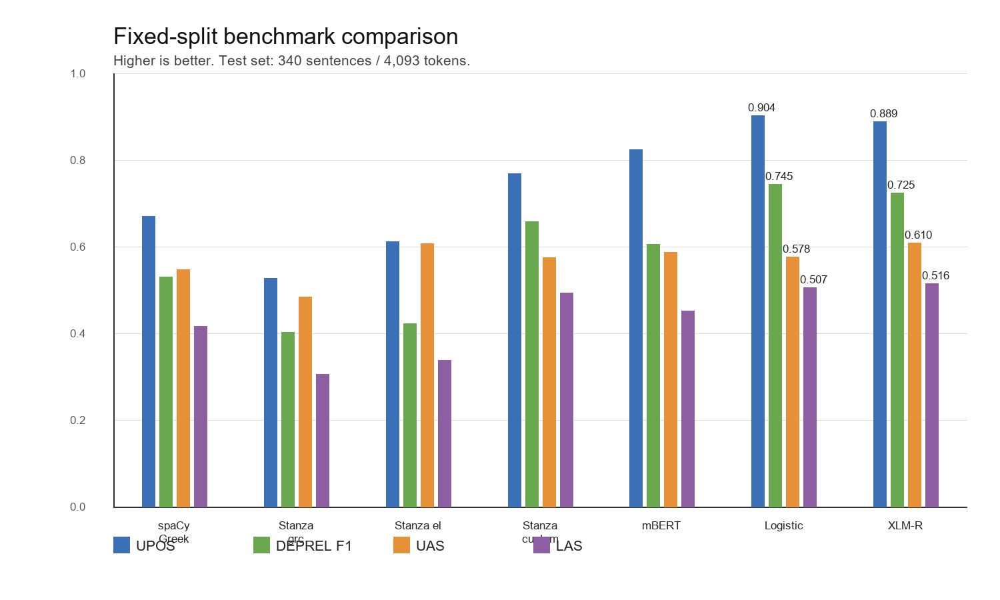

<div align="center">

# kathnlp — Katharevousa Greek NLP

**A Universal-Dependencies-style morphological and dependency parser for Katharevousa Greek parliamentary text.**

[](https://arxiv.org/abs/2605.22978)
[](https://www.python.org)
[](#status)
[](paper/main.tex)

</div>

---

## About

`kathnlp` builds the first reproducible NLP pipeline targeted at **Katharevousa Greek**, the archaizing official register used in 20th-century Greek law, administration, and parliamentary discourse. Off-the-shelf Greek and Ancient Greek parsers cover this register poorly: standard Greek pipelines miss morphology and dependency structure that are routine in parliamentary questions from the 1970s, and Ancient Greek pipelines mismatch the modern institutional vocabulary.

The project releases:

- a frozen, UD-style annotated reference set of **1,697 sentences**;
- a fixed train/test split and a shared evaluation protocol;
- benchmark reports for spaCy Greek, Stanza Greek, Stanza Ancient Greek (PROIEL), mBERT, XLM-R, and a transparent feature-based baseline;
- the data construction, annotation, training, and evaluation code used to produce them.

## Highlights

Fixed 340-sentence held-out split (seed 42), reference token boundaries, identical scoring code for all systems.

| Model                          | UPOS       | DEPREL F1  | UAS        | LAS        |
|--------------------------------|------------|------------|------------|------------|
| spaCy Greek                    | 0.6721     | 0.5315     | 0.5492     | 0.4183     |
| Stanza Greek (pretrained)      | 0.6125     | 0.4242     | 0.6079     | 0.3396     |
| Stanza Ancient Greek PROIEL    | 0.5292     | 0.4044     | 0.4850     | 0.3076     |
| mBERT                          | 0.8260     | 0.6076     | 0.5886     | 0.4537     |
| Stanza (custom-trained)        | 0.7694     | 0.6588     | 0.5756     | 0.4943     |
| Feature-based baseline         | **0.9040** | **0.7451** | 0.5781     | 0.5072     |
| **XLM-R (release candidate)**  | 0.8893     | 0.7250     | **0.6098** | **0.5162** |

The XLM-R release candidate improves LAS by **+0.0980 absolute** over the strongest off-the-shelf baseline (spaCy Greek). The feature-based parser remains best for UPOS and dependency-relation labeling, which is itself a methodological finding for low-resource historical NLP.



## Installation

```bash
git clone https://github.com/gmikros/katharevousa-nlp-tooling.git
cd katharevousa-nlp-tooling
pip install -e .
```

Requires Python 3.10+. PyTorch and Transformers are pulled in automatically; install a CUDA-enabled `torch` first if you intend to train on GPU.

## Quick start

Train the release-candidate XLM-R parser on the frozen reference set:

```bash
python scripts/train_transformer_parser.py \
  --gold-path data/processed/final_gold/gold_final.conllu \
  --encoder-name xlm-roberta-base \
  --epochs 3 --batch-size 4
```

Reproduce the external-library baselines on the same split:

```bash
python scripts/evaluate_external_baselines.py
```

End-to-end corpus reconstruction (OCR exports → frozen CoNLL-U snapshot) is documented in [`docs/MAINTAINER.md`](docs/MAINTAINER.md).

## Repository layout

```
configs/      annotation schema and run configuration
data/         reconstructed corpus and frozen reference snapshots
docs/         design notes and maintainer documentation
paper/        LaTeX manuscript (Overleaf-ready)
reports/      benchmark JSON reports for every released model
scripts/      data construction, training, and evaluation entrypoints
src/kathnlp/  library code (pipelines, training, metrics)
```

## Paper

The full methodology, error analysis, and discussion are published as an arXiv preprint:

> **A Reproducible Universal Dependencies-Style Pipeline for Katharevousa Greek Parliamentary Text.** George Mikros, Fotios Fitsilis. arXiv:2605.22978, 2026. <https://arxiv.org/abs/2605.22978>

The LaTeX source lives under [`paper/`](paper) and is structured as a single-file build (`paper/main.tex`) for direct Overleaf import from this repository.

## Citation

If you use `kathnlp`, the reference annotations, or the benchmark protocol, please cite:

```bibtex
@misc{mikrosfitsilis2026kathnlp,
  title         = {A Reproducible Universal Dependencies-Style Pipeline for
                   Katharevousa Greek Parliamentary Text},
  author        = {Mikros, George and Fitsilis, Fotios},
  year          = {2026},
  eprint        = {2605.22978},
  archivePrefix = {arXiv},
  primaryClass  = {cs.CL},
  url           = {https://arxiv.org/abs/2605.22978}
}
```

## Status

This is a research preview. The reference annotations are automatically validated rather than fully expert-adjudicated, and the held-out split is small (340 sentences / 4,093 tokens). Expert review with philologist annotators is in progress and will be released as a versioned update, together with a Hugging Face model release for the XLM-R candidate.

## Acknowledgements

The source corpus is the archive of 1976–1977 written Greek parliamentary questions used in the companion digital-humanities study by Mikros & Fitsilis. We thank the philologist reviewers contributing to the human-adjudication phase.
